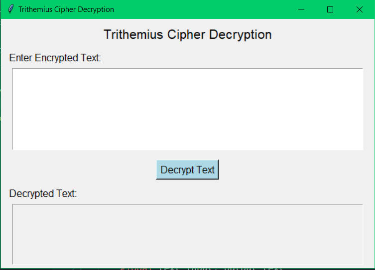

# Trithemius-chipper-decryption

Trithemius chipper decryption ignoring white spaces and punctuations

Run python main.py in the terminal and a tkinter gui windows should appear on your screen:

The result of the decryption can vary from the ones in the posted because it retains the white space and punctuation marks
in the decrypted text aslo.
